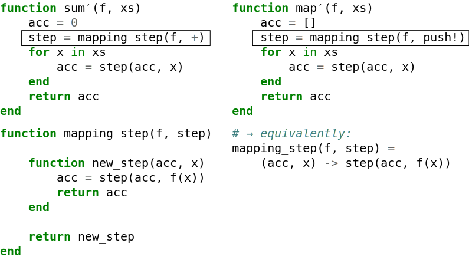
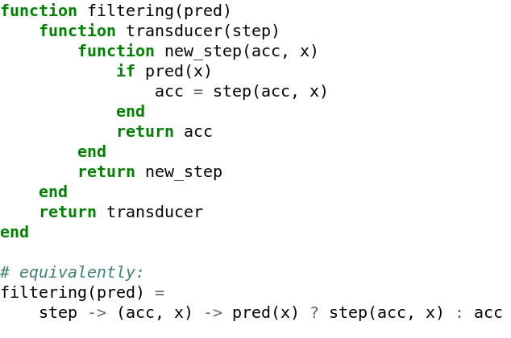
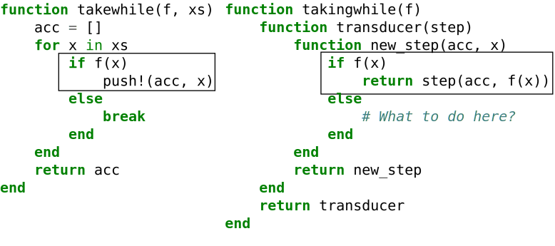
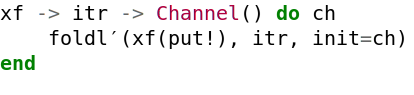

class: center, middle

# Transducers: data-oriented abstraction for sequential and parallel algorithms on containers

### Takafumi Arakaki (`@tkf`)

#### University of Oregon

---

class: center, middle

# `foldl` is great! Let's use it everywhere.

### Takafumi Arakaki (`@tkf`)

#### University of Oregon

---

# "Transducers" by Rich Hickey


---

# Agenda

* What are transducers?
    * "Deriving" transducers via refactoring

* Characteristics of transducers
    * Comparison to iterators
    * Comparison to broadcasting

* Why it's appealing to have transducers in Julia?
    * `foldl`, not transducers themselves, let us write
      high-performance and composable code

---

class: center, middle

# A transducer transform a _loop body_

---

# Example 1: `sum`

<table style="width: 100%;">
  <tr>
    <td style="width: 50%; padding: 50px 50px 50px 50px;">
      
    </td>
    <td>
      \\(\displaystyle \sum_i f(x_i) \\)
    </td>
  </tr>
<table>

---

# Example 2: `map`

<table style="width: 100%;">
  <tr>
    <td style="width: 50%; padding: 50px 50px 50px 50px;">
      
    </td>
    <td>
      \\(\displaystyle y_i = f(x_i) \\)
    </td>
  </tr>
<table>

---

# Refactoring `sum` and `map`


---

# Refactoring `sum` and `map`


---

# Refactoring `sum` and `map`


---

# Refactoring `sum` and `map`


---

# Refactoring `sum` and `map`


---

# Refactoring `sum` and `map`


---

# Refactoring `sum` and `map`



---

# Refactoring `sum` and `map`


---

# Refactoring `sum` and `map`


---

# Refactoring `sum` and `map`


---

# Does it work with other loops?


---

# Does it work with other loops?


---

# Does it work with other loops?


---

# Problem: `mapping_step` and `filtering_step` do not compose well


---

# Transducer: <span style="white-space:nowrap;">step function</span> -to- <span style="white-space:nowrap;">step function</span> transformation


---

# Transducer: <span style="white-space:nowrap;">step function</span> -to- <span style="white-space:nowrap;">step function</span> transformation



---

# Transducers are composable


---

# Can a transducer truncate inputs?


---

# Can a transducer truncate inputs?



---

# Can a transducer truncate inputs?


---

# Supporting termination in `foldl`


---

# Supporting termination in `foldl`


---

# Transducer can truncate input


---

# Transducers + "extended" `foldl` can do:

## Mapping
## Filtering
## Early termination
## Flattening (expansion / nested loop)
## Stateful computation (scan)

---

# How do transducers/`foldl` relate to iterators?


| Iterators | | Transducers/`foldl` |
| ----- | ----- | ----- |
| 　 | 　 | 　 |
| iterator | | reducing step function |
| `state → (state, x)` | | `(acc, x) → acc` |
| `Base.iterate` | | e.g., `+`, `push!` |
| 　 | 　 | 　 |
| iterator transform | | transducer |
| e.g., `iter -> map(f, iter)` | | e.g., `mapping(f)` |
| 　 | 　 | 　 |
| `for`-loop | | `foldl′` |

<small>
See: discussion with Jan Weidner (`@jw3126`)
https://github.com/tkf/Transducers.jl/issues/13
</small>

---

# Are transducers as powerful as iterator transforms? (yes)

<table>
  <tr>
    <th>
      Iterator transform
      <span style="white-space:nowrap;">→ Transducers</span>
    </th>
    <th>
      Transducers
      <span style="white-space:nowrap;">→ Iterator transform</span>
    </th>
  </tr>
  <tr>
    <td valign="top">
      
    </td>
    <td valign="top">
      <p>
        
      </p>
      <p>
        see also: `eduction`
      </p>
    </td>
  </tr>
<table>

---

# `foreach` for `for`-like syntax


---

# `foreach` supports `for`-`else` and `break`-with-value


<table>
  <tr>
    <td valign="top">
      
    </td>
    <td valign="top">
      
    </td>
  </tr>
<table>

See: https://github.com/JuliaLang/julia/issues/22891

---

class: center, middle

# If transducers are as powerful as iterator transforms, why would I want to use it?

---

class: center, middle

# Performance!

---

class: center, middle

# `foldl` has more optimization opportunities than `iterate`

---


# Who implements what?

<table class="mytable">
  <tr>
    <th></th>
    <th>Iterators</th>
    <th>Transducers</th>
  </tr>
  <tr class="implementee-row">
    <th>
    </th>
    <td>
      <code>iterate</code>
    </td>
    <td>
      reducing step function
    </td>
  </tr>
  <tr class="implementer-row">
    <th>
      Implementer:
    </th>
    <td>
      <i>container author</i>
    </td>
    <td>
      <i>user</i>
    </td>
  </tr>
  <tr class="implementee-row">
    <th>
      Loop executor
    </th>
    <td>
      <code>for</code>-loop
    </td>
    <td>
      <code>foldl</code>
    </td>
  </tr>
  <tr class="implementer-row">
    <th>
      Implementer:
    </th>
    <td>
      <i>user</i>
    </td>
    <td>
      <i>container author</i>
    </td>
  </tr>
<table>

---

class: center, middle

# `foldl`'s advantage: container library authors are the best persons to implement the loops

---

# Example: `LazyArrays.Vcat`

```julia-repl
julia> using LazyArrays, StaticArrays

julia> xs = Vcat(SVector(false), 1:1, [2.0])
3-element Vcat{Float64,1,Tuple{SArray{Tuple{1},Bool,1,1},UnitRange{Int64},Array{Float64,1}}}:
 0.0
 1.0
 2.0

julia> xs.arrays[1]
1-element SArray{Tuple{1},Bool,1,1} with indices SOneTo(1):
 0

julia> xs.arrays[2]
1:1

julia> xs.arrays[3]
1-element Array{Float64,1}:
 2.0
```

See also:
[BlockArrays.jl](https://github.com/JuliaArrays/BlockArrays.jl),
[RecursiveArrayTools.jl](https://github.com/JuliaDiffEq/RecursiveArrayTools.jl),
[MultiScaleArrays.jl](https://github.com/JuliaDiffEq/MultiScaleArrays.jl),
...

---

# Example: `LazyArrays.Vcat`

```julia
function foldl′(step, acc, vcat::LazyArrays.Vcat)
    for x in vcat.arrays[1]
        acc = step(acc, x)
    end
    for x in vcat.arrays[2]
        acc = step(acc, x)
    end
    ...
    for x in vcat.arrays[end]
        acc = step(acc, x)
    end
    return acc
end
```

<small>
Note: ignoring `Reduced`
</small>

---

# Example: `LazyArrays.Vcat`

```julia
function foldl′(step, acc, vcat::LazyArrays.Vcat)
    for x in vcat.arrays[1]
*       acc = step(acc, x)
    end
    for x in vcat.arrays[2]
*       acc = step(acc, x)
    end
    ...
    for x in vcat.arrays[end]
*       acc = step(acc, x)
    end
    return acc
end
```

* A reducing step function can be specialized for specific `eltype`.
* Loop "state" is encoded in the location in the code (program counter)

---

# Example: `LazyArrays.Vcat`

```julia
function foldl′(step, acc, vcat::LazyArrays.Vcat)
    acc = foldl′(step, acc, vcat.arrays[1])
    acc = foldl′(step, acc, vcat.arrays[2])
    ...
    acc = foldl′(step, acc, vcat.arrays[end])
    return acc
end
```

* Each sub-_loop_ can be specialized.

---

# Example: `foldl` for `Vector{<:Vector}`

```julia
 using Transducers
 using Transducers: @next, complete

 struct VecOfVec{T}
     vectors::Vector{Vector{T}}
 end

 function Transducers.__foldl__(rf, acc, vov::VecOfVec)
     for vector in vov.vectors
         for x in vector
             acc = @next(rf, acc, x)
         end
     end
     return complete(rf, acc)
 end
```

---

# Example: `foldl` for `Vector{<:Vector}`

```julia
 using Transducers
 using Transducers: @next, complete

*struct VecOfVec{T}
*    vectors::Vector{Vector{T}}
*end

 function Transducers.__foldl__(rf, acc, vov::`VecOfVec`)
     for vector in vov.vectors
         for x in vector
             acc = @next(rf, acc, x)
         end
     end
     return complete(rf, acc)
 end
```

---

# Example: `foldl` for `Vector{<:Vector}`

```julia
 using Transducers
 using Transducers: @next, complete

 struct VecOfVec{T}
     vectors::Vector{Vector{T}}
 end

 function Transducers.__foldl__(rf, acc, vov::VecOfVec)
*    for vector in vov.vectors
*        for x in vector
*            acc = @next(rf, acc, x)
*        end
*    end
     return complete(rf, acc)
 end
```

---

# Example: `foldl` for `Vector{<:Vector}`

```julia
 using Transducers
 using Transducers: next, complete

 struct VecOfVec{T}
     vectors::Vector{Vector{T}}
 end

 function Transducers.__foldl__(rf, acc, vov::VecOfVec)
     for vector in vov.vectors
         for x in vector
*            acc′ = next(rf, acc, x)
*            acc′ isa Reduced && return acc′
*            acc = acc
         end
     end
     return complete(rf, acc)
 end
```

---

# Example: `foldl` for `Vector{<:Vector}`

```julia
 using Transducers
 using Transducers: @next, complete

 struct VecOfVec{T}
     vectors::Vector{Vector{T}}
 end

 function Transducers.__foldl__(rf, acc, vov::VecOfVec)
     for vector in vov.vectors
*        @simd for x in vector
             acc = @next(rf, acc, x)
         end
     end
     return complete(rf, acc)
 end
```

---

# `iterate` for `Vector{<:Vector}`

```julia
function Base.iterate(vov::VecOfVec, state=(1, 1))
    i, j = state
    i > length(vov.vectors) && return nothing

    vi = vov.vectors[i]
    if j <= length(vi)
        return vi[j], (i, j + 1)
    end

    for k in i + 1:length(vov.vectors)
        vk = vov.vectors[k]
        if !isempty(vk)
            return vk[1], (k, 2)  # i=k, j=2
        end
    end
    return nothing
end
```

---

# Algebraic properties

### Reducing functions can be...

* Associative: _grouping doesn't matter!_ <sup>†</sup>
* Commutative: _order doesn't matter!_ <sup>†</sup>

<small>
<sup>†</sup>
See: [How to Think about Parallel Programming: Not! by Guy Steele](http://www.infoq.com/presentations/Thinking-Parallel-Programming)
</small>

### Transducers can be...

* Stateful (→ breaks associativity/commutativity)
* Terminating (→ breaks commutativity)
* Expansive (→ makes `collect`/`copy!`/`map!` hard)

???
cf https://en.wikipedia.org/wiki/Loop_dependence_analysis

---

# `foldl`-based API to implement GEMM

```julia
 using NDReducibles: ndreducible
 using Referenceables: referenceable

 foreach(
     ndreducible(
         referenceable(C) => (:i, :j),  # mark that we want to mutate C
         A => (:i, :k),
         B => (:k, :j),
     ),
 ) do (c, a, b)
     c[] += a * b
 end
```

See: https://tkf.github.io/NDReducibles.jl/dev/

---

# `foldl`-based API to implement GEMM

```julia
 foreach(
     ndreducible(
         referenceable(C) => (:i, :j),
         A => (:i, :k),
         B => (:k, :j),
     ),
 ) do (c, a, b)
     c[] += a * b
 end
```

* There is so little `foreach` users can do during the loop (but
  that's all they need).
    * Even indexing is automatically handled (no need for manual `@inbounds`).
* There is so much `foldl` implementers can do.
    * Parallelization?
      Cache-oblivious access pattern?
      Optional manual scheduling (e.g., Halide)?

---

# Summary

### Julia ecosystem has a rich set of custom arrays and containers.

### `foldl` may be the best API to capture the diverse requirements for efficiently executing loops for them.

### `Base.foldl` is not enough because...

* It does not capture the full `for`/`iterate` semantics
* It does not have mechanisms equivalent to iterator transforms (e.g., `Iterators.filter`)

### Extended `foldl` and transducers solve these problems.

---

---

class: center, middle

# Appendix

---

# Transducers can expand input


---

# Can transducer have state?

## Clojure's solution: closure


---

# Can transducer have state?

## Transducers.jl's solution (based on Ableton/atria)


See also:
[CppCon 2015: Juan Pedro Bolívar Puente “Transducers: from Clojure to C++"](https://www.youtube.com/watch?v=vohGJjGxtJQ)


---

# Example: circular sliding windows (handling the edges)

```julia
julia> foldl′(push!, Map(collect), `circularwindows(1:9, 2)`; init=[])
9-element Array{Any,1}:
 [8, 9, 1, 2, 3]
 [9, 1, 2, 3, 4]
 [1, 2, 3, 4, 5]
 [2, 3, 4, 5, 6]
 [3, 4, 5, 6, 7]
 [4, 5, 6, 7, 8]
 [5, 6, 7, 8, 9]
 [6, 7, 8, 9, 1]
 [7, 8, 9, 1, 2]
```

---

# Example: circular sliding windows (handling the edges)

```julia
julia> foldl′(push!, Map(collect), circularwindows(1:9, `2`); init=[])
9-element Array{Any,1}:
 [`8, 9`, 1, `2, 3`]
 [`9, 1`, 2, `3, 4`]
 [`1, 2`, 3, `4, 5`]
 [`2, 3`, 4, `5, 6`]
 [`3, 4`, 5, `6, 7`]
 [`4, 5`, 6, `7, 8`]
 [`5, 6`, 7, `8, 9`]
 [`6, 7`, 8, `9, 1`]
 [`7, 8`, 9, `1, 2`]
```

---

# Example: circular sliding windows (handling the edges)

```julia
julia> foldl′(push!, `Map(collect)`, circularwindows(1:9, 2); init=[])
9-element Array{Any,1}:
 [8, 9, 1, 2, 3]
 [9, 1, 2, 3, 4]
 [1, 2, 3, 4, 5]
 [2, 3, 4, 5, 6]
 [3, 4, 5, 6, 7]
 [4, 5, 6, 7, 8]
 [5, 6, 7, 8, 9]
 [6, 7, 8, 9, 1]
 [7, 8, 9, 1, 2]
```

---

# Example: circular sliding windows (handling the edges)

```julia
 function circularwindows(xs::AbstractVector, h::Integer)
     return AdHocFoldable(xs) do rf, acc, xs
         buffer = similar(xs, 2 * h + 1)
         for i in 1:h
             buffer[1:h - i + 1] .= @view xs[end - h + i:end]
             buffer[h - i + 2:end] .= @view xs[1:h + i]
             acc = @next(rf, acc, buffer)
         end
         for i in h + 1:length(xs) - h
             acc = @next(rf, acc, @view xs[i - h:i + h])
         end
         for i in 1:h
             buffer[1:end - i] .= @view xs[end - 2 * h + i:end]
             buffer[end - i + 1:end] .= @view xs[1:i]
             acc = @next(rf, acc, buffer)
         end
         return complete(rf, acc)
     end
 end;
```

---

# Example: circular sliding windows (handling the edges)

```julia
 function circularwindows(xs::AbstractVector, h::Integer)
     return AdHocFoldable(xs) do rf, acc, xs
         buffer = similar(xs, 2 * h + 1)
*        for i in 1:h
*            buffer[1:h - i + 1] .= @view xs[end - h + i:end]
*            buffer[h - i + 2:end] .= @view xs[1:h + i]
*            acc = @next(rf, acc, buffer)
*        end
         for i in h + 1:length(xs) - h
             acc = @next(rf, acc, @view xs[i - h:i + h])
         end
*        for i in 1:h
*            buffer[1:end - i] .= @view xs[end - 2 * h + i:end]
*            buffer[end - i + 1:end] .= @view xs[1:i]
*            acc = @next(rf, acc, buffer)
*        end
         return complete(rf, acc)
     end
 end;
```

---

# Example: circular sliding windows (handling the edges)

```julia
 function circularwindows(xs::AbstractVector, h::Integer)
     return AdHocFoldable(xs) do rf, acc, xs
         buffer = similar(xs, 2 * h + 1)
         for i in 1:h
             buffer[1:h - i + 1] .= @view xs[end - h + i:end]
             buffer[h - i + 2:end] .= @view xs[1:h + i]
             acc = @next(rf, acc, buffer)
         end
*        for i in h + 1:length(xs) - h
*            acc = @next(rf, acc, @view xs[i - h:i + h])
*        end
         for i in 1:h
             buffer[1:end - i] .= @view xs[end - 2 * h + i:end]
             buffer[end - i + 1:end] .= @view xs[1:i]
             acc = @next(rf, acc, buffer)
         end
         return complete(rf, acc)
     end
 end;
```

---

# Can `foldl` solve the "tricky iteration problems?"

[Julep: solving tricky iteration problems](https://github.com/JuliaLang/julia/issues/15648)

<table class="mytable">
  <tr>
    <th>Matrix-matrix multiplication</th>
    <th>N-dimensional copy</th>
  </tr>
  <tr>
    <td>
      <p>
        \\(C\_{ij} = \sum\_{k} A\_{ik} B\_{kj}\\)
      </p>
    </td>
    <td>
      <p>
        \\(Y\_{i\_1, ..., i\_N} = X\_{i\_1, ..., i\_N}\\)
      </p>
    </td>
  </tr>
<table>

* How to choose an order of the `for` loops?
* How to execute such loops?

---

# How to mutate arrays via `foldl`?

```julia-repl
julia> ys = zeros(3);

julia> ys_ref = `[Ref(ys, i) for i in eachindex(ys)]`;

julia> y1 = ys_ref[1];
       `y1[] = 123`
123

julia> ys
3-element Array{Float64,1}:
 `123.0`
   0.0
   0.0
```

---

# How to mutate arrays via `foldl`?

```julia-repl
julia> ys = zeros(3);

julia> ys_ref = [Ref(ys, i) for i in eachindex(ys)];

julia> y1 = ys_ref[1];
       y1[] = 123
123

julia> ys
3-element Array{Float64,1}:
 123.0
   0.0
   0.0

julia> foreach(`zip(ys_ref, ones(3))`) do (y, x)
           y[] = x
       end
```

---

# `foldl`-based API

```julia
 using NDReducibles: ndreducible
 using Referenceables: referenceable

 foreach(
     ndreducible(
         referenceable(C) => (:i, :j),  # mark that we want to mutate C
         A => (:i, :k),
         B => (:k, :j),
     ),
 ) do (c, a, b)
     c[] += a * b
 end
```

See: https://tkf.github.io/NDReducibles.jl/dev/

---

# `foldl`-based API

```julia
 using NDReducibles: ndreducible
 using Referenceables: referenceable

 foreach(
     ndreducible(
*        referenceable(C) => (:i, :j),  # mark that we want to mutate C
         A => (:i, :k),
         B => (:k, :j),
     ),
 ) do (c, a, b)
     `c[]` += a * b
 end
```

---

# `foldl`-based API

```julia
 foreach(
     ndreducible(
         referenceable(C) => (:i, :j),
         A => (:i, :k),
         B => (:k, :j),
     ),
 ) do (c, a, b)
     c[] += a * b
 end
```

* There is so little `foreach` users can do during the loop (but
  that's all they need).
    * Even indexing is automatically handled (no need for manual `@inbounds`).
* There is so much `foldl` implementers can do.
    * Parallelization?
      Cache-oblivious access pattern?
      Optional manual scheduling (e.g., Halide)?

---

# What about Broadcasting?

* `foldl` can also be used as a computation backend for broadcasting
  (and much more).

    * Absent indices correspond to singleton indices.

* `BroadcastStyle`-like mechanism to negotiate the loop order?

---

# What about tensor/multi-dimensional array libraries?

* [Jutho/TensorOperations.jl](https://github.com/Jutho/TensorOperations.jl)
* [JuliaArrays/TiledIteration.jl](https://github.com/JuliaArrays/TiledIteration.jl)
* [KristofferC/Tensors.jl](https://github.com/KristofferC/Tensors.jl)
* [andyferris/Tensors.jl](https://github.com/andyferris/Tensors.jl)
* [ahwillia/Einsum.jl](https://github.com/ahwillia/Einsum.jl)
* [shashi/ArrayMeta.jl](https://github.com/shashi/ArrayMeta.jl)
* [IntelLabs/ParallelAccelerator.jl](https://github.com/IntelLabs/ParallelAccelerator.jl)
* [mcabbott/TensorCast.jl](https://github.com/mcabbott/TensorCast.jl)
* ...

See: [For Loops 2.0: Index Notation And The Future Of Tensor Compilers | Peter Ahrens](https://www.youtube.com/watch?v=Rp7sTl9oPNI)

---

# What about tensor/multi-dimensional array libraries?

* Tortilla.jl can pattern match the loop description, _including loop
  body_, and dispatch to hand-tuned functions (e.g., `BLAS.gemm!`)
    * _`foreach` is not the ultimate surface syntax_
* `foldl` can wrap existing libraries (e.g., TiledIterations.jl)

---

# Quick Transducers.jl v0.3 highlights

### Transducers-via-comprehension

```julia
eduction(y for x in 1:10 if x % 2 == 0 for y in (x, x + 1))
```

### `GroupBy`: fusing group-by with per-group filtering, reduction, and termination

```julia
... |> GroupBy(identity, Map(last) |> Scan(+) |> ReduceIf(x -> x > 3)) |> ...
```

### "GPU support"

```julia
rf = reducingfunction(Map(CUDAnative.sin) |> Filter(x -> x > 0), +)
reduce(rf, A, init=0.0f0, dims=1)
```

---
